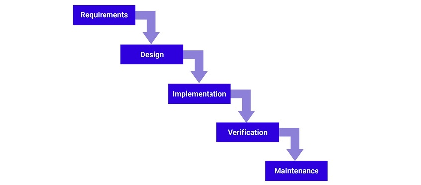

# Introduction

<!-- https://joeappleton18.github.io/web-dev-2021-notes/assessments/assessment_2_implementation_and_report_brief.html#deliverables -->

## Problem statement

Students of the university are facing mental issues due to this unexpected lockdown and the loss of people around them, and most of them don't have someone to talk to.

## The overarching methodology used for designing the website

While searching for the methodology, I started searching from Design Thinking methodology as it was mentioned in the assessment details, and as I gathered more information about it , I realized this is the one. Given its four principles that were laid out by Harry Leifer, Christoph Meinel from Stanford University. certain this is ideal for the project.

# Methodology

For development methodology, there were many great options such as `Agile Methodology`, `DevOps deployment methodology `, `Waterfall development method`, `Rapid application development` just to name a few. Given the scale of this specific web app, I have chosen ` Waterfall methodology`.

## A brief about Waterfall Methodology

The waterfall method is a rigid linear model that consists of sequential phases (requirements, design, implementation, verification, maintenance) focusing on distinct goals. Each phase must be 100% complete before the next phase can start. There’s usually no process for going back to modify the project or direction.Many consider the waterfall method to be the most traditional software development method.

Waterfall Development Methodology Flow Chart

Projects with clear objectives and stable requirements can best use the waterfall method. Less experienced project managers and project teams, as well as teams whose composition changes frequently, may benefit the most from using the waterfall development methodology.

## The sequential phases in the Waterfall model

### Requirement Gathering and analysis −

All possible requirements of the system to be developed are captured in this phase and documented in a requirement specification document.

### System Design −

The requirement specifications from the first phase are studied in this phase and the system design is prepared. This system design helps in specifying hardware and system requirements and helps in defining the overall system architecture.

### Implementation −

With inputs from the system design, the system is first developed in small programs called units, which are integrated in the next phase. Each unit is developed and tested for its functionality, which is referred to as Unit Testing.

### Verification / Integration and Testing −

All the units developed in the implementation phase are integrated into a system after testing of each unit. Post integration the entire system is tested for any faults and failures.

### Deployment of system and Maintenance −

- There are some issues that come up in the client environment. To fix those issues, patches are released. Also to enhance the product some better versions are released. Maintenance is done to deliver these changes in the customer environment.

- Once the functional and non-functional testing is done; the product is deployed in the customer environment or released into the market.

# Method

Now , i will explain how i implemented the `Waterfall Methodology` into the project by diving into each and every stages of the mentioned methodolgy.

### Requirement Gathering and analysis −

The problem statement ad all the required information have been discussed in the Introduction section.To reiterate , the roblem statement is to provide a web-app/ prtal for the student who have been facing any mental strees due to covid pandemic or just because of anything really.

### System Design −

Since the main product out of this project is a web-app so the technologies/tech stack we will use will be related to web.

- For frontend i have used `Reactjs` because of it's component-based architecture which is helpfull while upscaling
- Since this is the first iteration of the web-app , I have not used any database.
- For hosting the project i will be making use of netlify , as netlify porvides easy and free deployment of frontend

### Implementation −

This step deals with actual code and technicalities of the project , so in this project i have used following technologies

- `Reactjs` - For frontend UI , It is a open-source javascript framework for frontend developed and used by `facebook.com`
- `Materialize CSS` - CSS famework for easy implmentation of css classes and easy to make the wesite responsive and accesible on the smaller devices like iPad or mobile phones , as users won't always visit the website using the computer. Based on google's Material design UI etiquettes
- `Netlify` - Used for deployment of the website , very easy-to-use (drag and drop folder) deployment. Continously deploys build from `git` repository when pushed on the master branch
- `Git` - Used for tracking the development process of the website and organize project

### Verification / Integration and Testing −

For the testing part of the website , since we have used Reactjs , we would need to do component testing for all the component , we can do it by implementing a `Github Action` , which would run the cron job to test the new component before deploying it to the main CI/CD pipeline in production.

### Deployment of system and Maintenance −

The deployment and the maintenance are done through git and netlify .For the second version of website the backend can be deployed onto vercel(preferrably) or heroku. Can implement CI/CD pipeline if decided to pursue this project as a startup.

# Appendix

> _In common practice, waterfall methodologies result in a project schedule with 20–40% of the time invested for the first two phases, 30–40% of the time to coding, and the rest dedicated to testing and implementation. The actual project organisation needs to be highly structured. Most medium and large projects will include a detailed set of procedures and controls, which regulate every process on the project_ .
> [View on Wiki](https://en.wikipedia.org/wiki/Waterfall_model#:~:text=In%20common%20practice,on%20the%20project.)

# Conclusion

Here i conclude the project and have learned about the `Waterfall Methodology` and have learnt that the methodology is well suited for the small scale project and when the requirement is expected to remain unchanged, which was the case in this project.

# References

- [Wiki - Waterfall_model](https://en.wikipedia.org/wiki/Waterfall_model)
- [What is waterfall methodology](https://www.softwaretestinghelp.com/what-is-sdlc-waterfall-model/)
- [Reactjs Docs](https://reactjs.org/docs/getting-started.html)
- [Materialize CSS](https://materializecss.com/getting-started.html)
